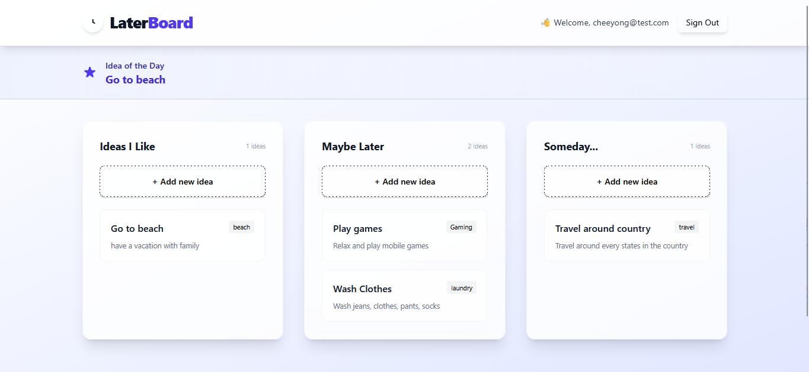

# [LaterBoard](https://laterboard.vercel.app)

A minimal, calm space to offload your non-urgent ideas, creative thoughts, future plans, or maybe-later projects into organized stacks. Built with Vue 3 and Vite.



## Features

- Three stacks: **Ideas I Like**, **Maybe Later**, **Someday...**
- Add, edit, and delete ideas in each stack
- Responsive, clean, and modern UI
- Authentication (email/password, social login)
- Random "Idea of the Day" inspiration

## Setup

1. **Clone the repository:**
   ```bash
   git clone https://github.com/leecheeyong/laterboard.git
   cd laterboard
   ```
2. **Install dependencies:**
   ```bash
   npm install
   # or
   yarn install
   ```
3. **Configure Firebase:**
   - Go to [Firebase Console](https://console.firebase.google.com/) and create a new project.
   - Enable **Authentication** (Email/Password).
   - Set up **Cloud Firestore** in test mode (or with secured rules).
   - Edit the `src/firebase.js` file, replace with your Firebase credentials

## License

LaterBoard is available as open source under the terms of the [MIT License](https://github.com/leecheeyong/LaterBoard/blob/main/LICENSE).
